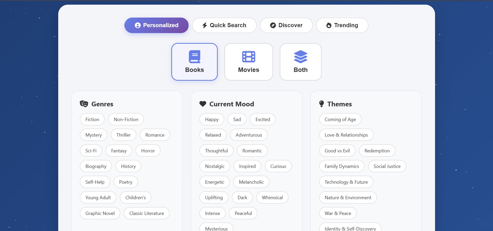
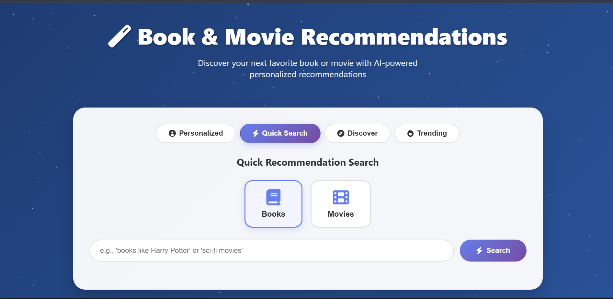
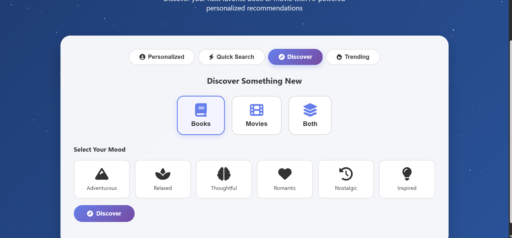
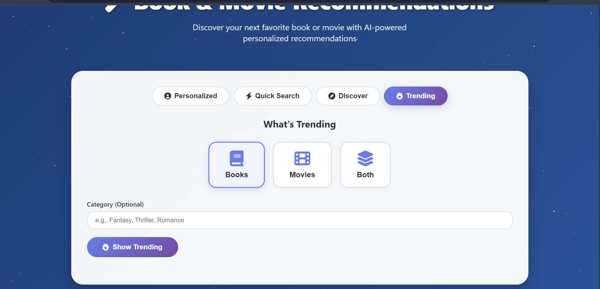

# 🎭 Book & Movie Recommendation Engine

<div align="center">
  
  
  
  
  

  <p align="center">
    <b>Discover your next favorite book or movie with AI-powered personalized recommendations</b><br>
    <i>Using Google's Gemini AI to understand your preferences and suggest perfect matches</i>
  </p>

  <a href="#-features"></a>
  <a href="#-quick-start"></a>
  <a href="#-api-documentation"></a>
  <a href="#-deployment"></a>
</div>

---

## ✨ Features

### 🎯 Recommendation Modes

1. **Personalized Recommendations**
   - Based on genres, moods, themes, and favorite titles
   - Customizable number of recommendations
   - Detailed explanations for each suggestion

2. **Quick Search**
   - Simple queries like "books like Harry Potter"
   - Instant recommendations without detailed preferences

3. **Mood-Based Discovery**
   - Select your current mood
   - Get perfectly matched recommendations

4. **Trending Content**
   - Discover what's popular right now
   - Filter by category or genre

### 🚀 Key Capabilities

- **Multi-Media Support**: Books, movies, or both
- **AI-Powered Analysis**: Using Gemini 2.0 Flash for intelligent recommendations
- **Rich Metadata**: Ratings, genres, descriptions, and where to find content
- **Beautiful UI**: Modern, responsive design with smooth animations
- **Fast Response**: Optimized for quick recommendations

## 🛠️ Tech Stack

| Component | Technology | Purpose |
|-----------|------------|---------|
| **Backend** | FastAPI + Python | High-performance API server |
| **AI Model** | Gemini 2.0 Flash | Fast, intelligent recommendations |
| **Frontend** | HTML/CSS/JS | Modern, responsive interface |
| **Deployment** | Railway | Cloud hosting platform |

## 🚀 Quick Start

### Prerequisites
- Python 3.11+
- [Gemini API Key](https://makersuite.google.com/app/apikey) (free)

### Local Setup

1. **Clone the repository**
   ```bash
   git clone https://github.com/omara2001/Book-Movie-Recommendation-Tool.git
   cd recommendation-engine
   ```

2. **Install dependencies**
   ```bash
   cd backend
   pip install -r requirements.txt
   ```

3. **Set environment variable**
   ```bash
   export GEMINI_API_KEY=your_gemini_api_key
   ```

4. **Run the backend**
   ```bash
   uvicorn main:app --reload
   ```

5. **Open the frontend**
   ```bash
   cd ..
   python -m http.server 8000
   ```

   Visit http://localhost:8000

## 📖 API Documentation

### Endpoints

| Endpoint | Method | Description |
|----------|--------|-------------|
| `/recommend` | POST | Get personalized recommendations |
| `/quick-recommend` | POST | Quick recommendations from query |
| `/discover` | POST | Mood-based discovery |
| `/trending` | POST | Get trending content |
| `/similar/{type}/{title}` | GET | Find similar items |
| `/genres/{type}` | GET | Get available genres |
| `/moods` | GET | Get available moods |
| `/themes` | GET | Get available themes |

### Example Requests

#### Personalized Recommendations
```json
{
  "media_type": "books",
  "preferences": {
    "genres": ["Fantasy", "Sci-Fi"],
    "favorites": ["Harry Potter", "Dune"],
    "mood": ["Adventurous", "Thoughtful"],
    "themes": ["Coming of Age", "Good vs Evil"]
  },
  "recommendation_count": 5
}
```

#### Quick Search
```json
{
  "media_type": "movies",
  "query": "sci-fi movies like Inception",
  "count": 3
}
```

#### Mood Discovery
```json
{
  "media_type": "both",
  "mood": "relaxed",
  "time_period": "modern"
}
```

## 🚂 Deployment

### Railway Deployment

1. **Fork this repository**

2. **Create Railway account** at [railway.app](https://railway.app)

3. **Create new project**
   - Click "New Project"
   - Select "Deploy from GitHub"
   - Choose your forked repository

4. **Set environment variables**
   ```
   GEMINI_API_KEY=your_gemini_api_key
   ```

5. **Deploy**
   - Railway automatically detects and deploys the Python app
   - Get your deployment URL from Railway dashboard

6. **Update frontend**
   - Update `API_URL` in the frontend with your Railway URL
   - Deploy frontend to GitHub Pages or Netlify

## 🎨 Features Overview

### 📚 Book Recommendations
- Fiction & Non-fiction
- Multiple genres
- Author information
- Publication details
- Where to read/buy

### 🎬 Movie Recommendations
- All genres
- Director & cast info
- Release years
- Ratings
- Streaming platforms

### 🎯 Smart Matching
- Preference analysis
- Mood matching
- Theme recognition
- Similar content finding

## 📸 Screenshots

<div align="center">
  <table>
    <tr>
      <td width="50%">
        
        <p align="center"><b>Personalized Recommendations</b></p>
      </td>
      <td width="50%">
        
        <p align="center"><b>Quick Search</b></p>
      </td>
    </tr>
    <tr>
      <td width="50%">
        
        <p align="center"><b>Mood-Based Discovery</b></p>
      </td>
      <td width="50%">
        
        <p align="center"><b>Trending Content</b></p>
      </td>
    </tr>
  </table>
</div>

## 🔧 Configuration

### Environment Variables

| Variable | Description | Required |
|----------|-------------|----------|
| `GEMINI_API_KEY` | Google Gemini API key | ✅ |
| `PORT` | Server port (auto-set by Railway) | ❌ |

### Customization Options

- **Add Genres**: Modify the genre lists in `/genres/{type}` endpoint
- **Add Moods**: Update the moods list in `/moods` endpoint
- **UI Theme**: Modify CSS variables in the frontend
- **Response Format**: Adjust AI prompts for different recommendation styles

## 🤝 Contributing

1. Fork the repository
2. Create your feature branch (`git checkout -b feature/amazing-feature`)
3. Commit changes (`git commit -m 'Add amazing feature'`)
4. Push to the branch (`git push origin feature/amazing-feature`)
5. Open a Pull Request

## 📈 Roadmap

- [ ] User accounts and saved preferences
- [ ] Recommendation history
- [ ] Social sharing features
- [ ] Book/Movie clubs integration
- [ ] Reading/Watching lists
- [ ] Review aggregation
- [ ] Mobile app version
- [ ] Browser extension

## 🐛 Troubleshooting

<details>
<summary><b>Common Issues</b></summary>

### API Key Issues
- Verify your Gemini API key is correct
- Check if you have API quota remaining
- Ensure the key has proper permissions

### No Recommendations
- Check if preferences are properly formatted
- Verify media type selection
- Try simpler queries first

### Slow Response
- Gemini API might be under load
- Try reducing recommendation count
- Check your internet connection

</details>

## 📚 Examples

### Find Books Like Your Favorites
```
"Books like The Lord of the Rings and Harry Potter"
→ Fantasy epics with rich world-building
```

### Mood-Based Movie Discovery
```
Mood: "Nostalgic" + "Romantic"
→ Classic romantic films from the 80s-90s
```

### Genre Combinations
```
Genres: ["Sci-Fi", "Thriller"] + Mood: "Intense"
→ Mind-bending sci-fi thrillers
```

## 📄 License

This project is licensed under the MIT License - see the [LICENSE](LICENSE) file for details.

## 🙏 Acknowledgments

- **Google Gemini** - AI-powered recommendations
- **FastAPI** - Modern Python framework  
- **Railway** - Simple deployment platform
- All the books and movies that inspired this project

---

<div align="center">
  <p>
    <b>Built with ❤️ to help you discover amazing stories</b><br>
    <sub>If you find this helpful, please give it a ⭐</sub>
  </p>
  
  <a href="https://github.com/omara2001/Book-Movie-Recommendation-Tool">
    
  </a>
</div>